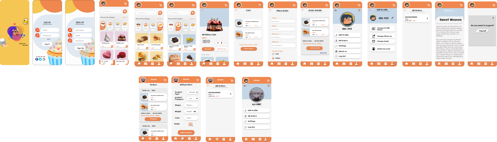

# Sweet Weve 🍰

**Sweet Weve** is an online bakery shop Android application with an integrated **admin panel** for managing orders, products, and users. It offers a seamless shopping experience for customers while enabling bakery owners to efficiently handle their business.

## 📸 Screenshot



## 📱 Features

### User Side
- 🛒 Browse and order bakery items online
- 🔍 Search and filter products
- 💳 Secure payment integration
- 📦 Track order status in real-time
- 📝 User authentication & profile management

### Admin Panel
- 📋 Manage products, categories, and pricing
- 📊 View and process customer orders
- 📦 Track order status and inventory

## 🛠️ Technologies Used
- **Backend:** Java (Android)
- **Database:** Firebase
- **UI:** XML

## 🚀 Installation & Setup
1. Clone the repository:
   ```bash
   git clone [https://github.com/yourusername/sweet-weve.git](https://github.com/KEvin-Topiya/sw.git)
   ```
2. Open the project in **Android Studio**.
3. Configure Firebase (if used) and backend API.
4. Build and run the app on an emulator or physical device.

## 📄 License
This project is **open-source** and available under the [MIT License](LICENSE).

## 🤝 Contributing
Contributions are welcome! Feel free to submit a pull request.
